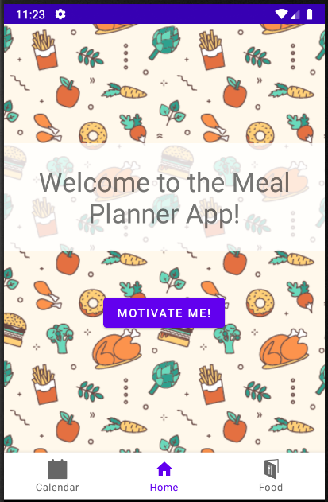
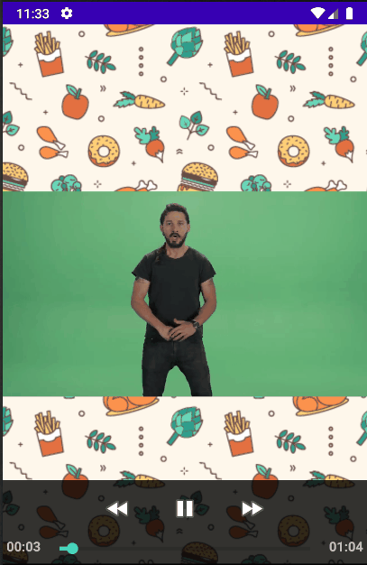
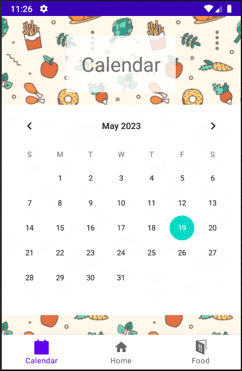
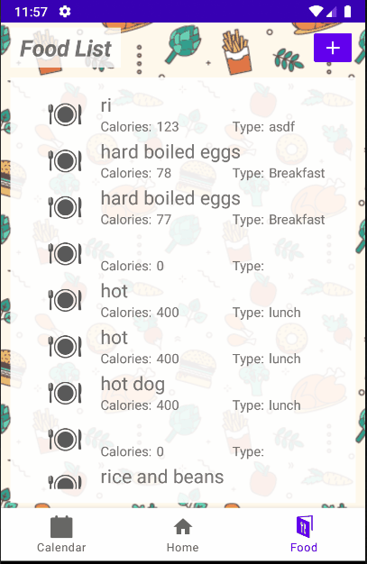

# Meal Planner App  
This is a simple meal planning app that allows you to save and create food recipes while helping you plan your meals for the week. 

 

## Table Of Contents:

* [Introduction](#Introduction)
* [The Team](#Team)
* [Features](#Game)
* [Acknowledgments](#Acknowledgments)

 

## Introduction  

Meal Planner App is a mobile application that was developed for my Fall 2022 Mobile Device Application Programming class at CSUF. This app was developed using Kotlin and Android Studio Chipmunk | 2021.2.1 Patch 2. The assignment was to create a mobile application in a team of 4-5 people an implement features such as callbacks, logging, layouts, resources, resource qualifiers, persistence, and UI flexibility.

 

## The Team  

* Anthony Cabacungan <antcabacungan@csu.fullerton.edu> 
* Anthony Soriano <soriano_anthony473@csu.fullerton.edu> 
* Darin Chan <dchan250@csu.fullerton.edu>
* Ken Cue <kencue@csu.fullerton.edu>
* Leonardo Medrano <lm1014367@csu.fullerton.edu> 

 

## Features  

* Home Page - leads to the calendar page, food page, and a special motivate me page

 

* Motivation Page - plays motivational videos to help you stay on track to eating healthier

 
 
* Calendar Page - a simple calendar page to help keep track of meals for the week, currently only shows the date

 
 
 * Food Page - allows you to view and create recipes that you have made, deleting and editing recipes has not been implemented yet

 
 
 ## Acknowledgments  

 Motivational Videos:
* [Motivational Lizard](https://www.youtube.com/watch?v=kGOQfLFzJj8)
* [Matsuoka Shuzo [松岡修造 ] - あきらめかけているあなた (NEVER GIVE UP!!) [English]](https://www.youtube.com/watch?v=KxGRhd_iWuE)
* [Shia LaBeouf "Just Do It" Motivational Speech (Original Video by LaBeouf, Rönkkö & Turner)](https://www.youtube.com/watch?v=ZXsQAXx_ao0)